# 🧠 Azure Advisor Notifier Architecture Overview

This document explains the **logical structure**, **component communication**, and **operational flow** of the Azure Advisor Notifier project.
It is designed to provide FinOps and DevOps teams with a precise understanding of how this cost optimization automation system works.

---

## 📦 System Objectives

- Automatically retrieve Azure Advisor recommendations
- Filter suggestions based on business criteria
- Notify teams via email with HTML-formatted reports
- Enable scalable, configurable, and auditable deployments using Terraform

---

## 📌 Key Infrastructure Components (Provisioned by Terraform)

| Component | Purpose | Key Technology |
|-----------|---------|----------------|
| `tfstate_storage.tf` | Deploys the Azure Storage Account + container used to store the Terraform state file | Azure Storage (Blob) |
| `backend.tf` | Configures Terraform to use the above storage account as a remote backend | Terraform backend block (azurerm) |
| `main.tf` | Provisions one or more Function Apps based on profiles, plus supporting resources | Azure Function App + Identity + App Service Plan + Storage |
| `function/` | Contains Python code and trigger definition for executing Advisor queries and sending notifications | Python Function App with Timer Trigger |

### 🔄 Backend Relationship Clarified

- `tfstate_storage.tf` creates the actual storage container where the `.tfstate` file is stored.
- `backend.tf` connects Terraform to this location so that it can share state between team members or CI/CD runs.

> 💡 Remote state is critical for avoiding race conditions and enabling safe collaboration in infrastructure deployments.

---

## 🧱 Component Interaction & Workflow

### 🌐 Deployment Phase

```mermaid
flowchart TD
    subgraph Terraform_Deployment
        TFSTATE[tfstate_storage.tf → Azure Blob]
        BACKEND[backend.tf ← reads from Blob]
        MAIN[main.tf → Multiple Function Apps by profile]
    end

    DEV[Developer or GitHub Action] --> TFSTATE
    TFSTATE --> BACKEND
    BACKEND --> MAIN
```



### ⚙️ Runtime Phase (Every Day at 09:00 UTC)

```mermaid
flowchart TD
    TTRIGGER([Timer Trigger: 0 0 9 * * *]) --> FUNAPP[Function App per profile - init.py]
    FUNAPP --> ADVISOR[Call Azure Advisor API]
    FUNAPP --> FILTER[Filter by Category / Cost / Tags / Type]
    FILTER --> REPORT[Generate HTML Report]
    REPORT --> EMAILSEND[Loop → MAIL_ENDPOINT]
```



---

## 🔁 Runtime Logic Summary

Each Function App receives environment variables specific to its profile, enabling:

- Distinct recipient lists (per department or client)
- Custom thresholds, categories, tags, and resource type filters
- Independent reporting logic and isolation

---

## 🔧 Environment Variables (Per Function App)

| Variable | Purpose |
|----------|---------|
| `EMAIL_RECIPIENTS` | Comma-separated list of recipient email addresses |
| `ADVISOR_THRESHOLD_COST` | Minimum potential cost saving required to include a recommendation |
| `ADVISOR_CATEGORIES` | Advisor categories to filter (e.g., Cost, HighAvailability) |
| `FILTER_TAGS` | A list of key=value pairs to filter only tagged resources |
| `ALLOWED_RESOURCE_TYPES` | List of resource type identifiers to include |
| `AZURE_SUBSCRIPTION_ID` | The Azure subscription used to query Advisor API (shared) |
| `MAIL_ENDPOINT` | External API for sending HTML reports (shared or profile-specific) |

---

## 🔁 Sample Multi-Profile Configuration (in `dev.tfvars`)

```hcl
report_profiles = {
  finance = {
    email_recipients       = ["finops@example.com", "cfo@example.com"]
    advisor_categories     = ["Cost"]
    advisor_threshold_cost = 50
    filter_tags = {
      department  = "finance"
      environment = "production"
    }
    allowed_resource_types = ["Microsoft.Compute/virtualMachines"]
  },

  devops = {
    email_recipients       = ["devops@example.com"]
    advisor_categories     = ["HighAvailability"]
    advisor_threshold_cost = 20
    filter_tags = {
      team        = "infrastructure"
      environment = "production"
    }
    allowed_resource_types = ["Microsoft.Sql/servers"]
  },

  clientA = {
    email_recipients       = ["client-a@example.com"]
    advisor_categories     = ["Cost"]
    advisor_threshold_cost = 25
    filter_tags = {
      customer_id = "A001"
    }
    allowed_resource_types = ["Microsoft.Web/sites"]
  }
}
```

---

## 📁 Directory Structure Recap

```bash
azure-advisor-notifier/
├── terraform/
│   ├── tfstate_storage.tf     # Deploys backend storage
│   ├── backend.tf             # Configures remote state
│   ├── main.tf                # Provisions all resources
│   ├── dev.tfvars             # Multi-profile overrides
│   └── *.tf                   # Other modules
│
├── function/
│   ├── __init__.py            # Main function logic
│   ├── function.json          # Timer trigger config
│   ├── requirements.txt       # Dependencies
│   └── local.settings.json    # Local dev environment (ignored by Git)
│
├── scripts/
│   └── test_advisor_api.py    # Local Advisor API test utility
├── .gitignore
└── README.md
```

---

## ✅ End-to-End Benefits

- ✅ Automated, actionable cloud cost visibility from Azure Advisor
- ✅ Declarative deployment via Terraform with remote state sharing
- ✅ Supports fine-grained control via tags, types, and categories
- ✅ Fully email-integrated with customizable endpoints
- ✅ Designed for extensibility (Power BI, approvals, dashboards)

---

For questions, contact the FinOps architecture team or cloud automation owner.
